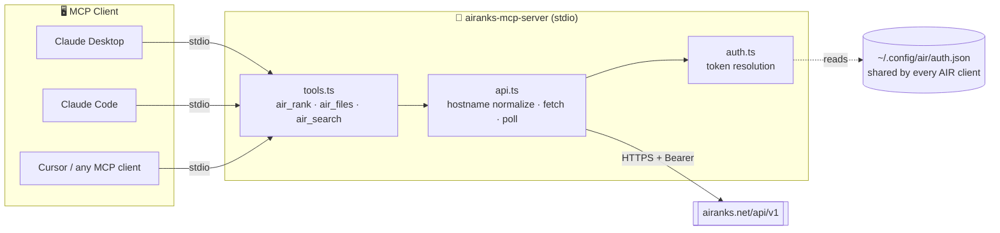
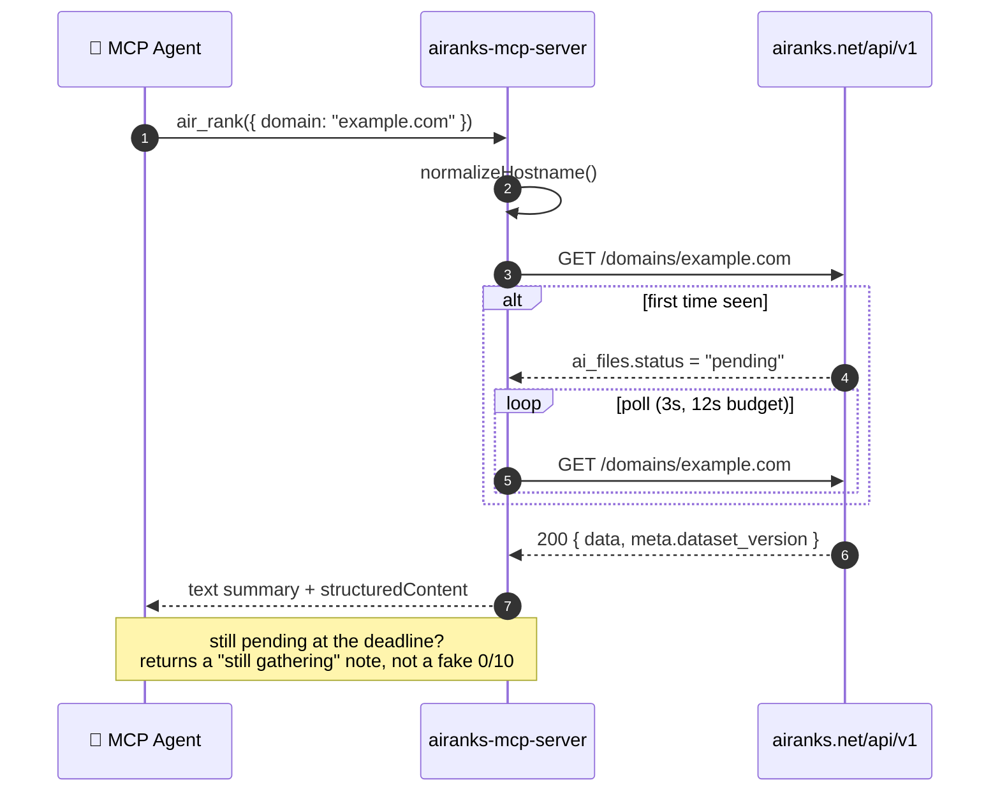
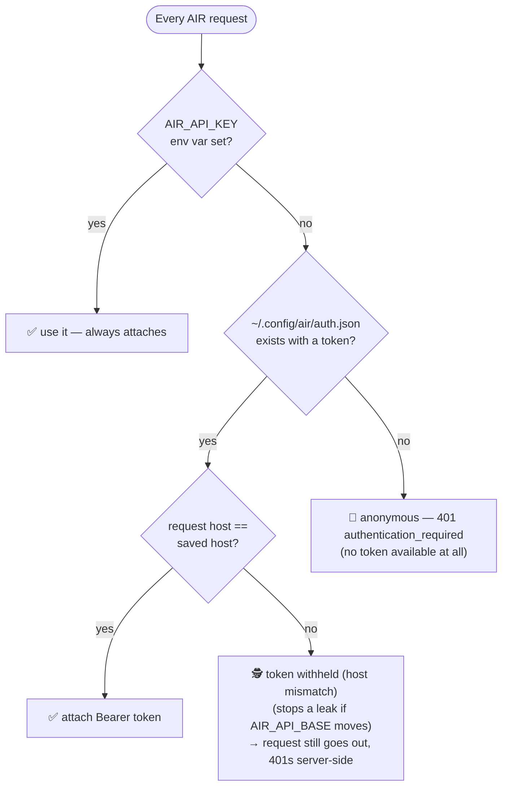

# 📡 airanks-mcp-server

**AIR — the authoritative rankings for AI web content.**

[](https://www.npmjs.com/package/airanks-mcp-server)
[](./LICENSE)
[](package.json)
[](tsconfig.json)
[](https://modelcontextprotocol.io)

> An [MCP (Model Context Protocol)](https://modelcontextprotocol.io) server that gives Claude,
> Cursor, and any other MCP client **three tools** — `air_rank`, `air_files`, `air_search` — to
> check how a domain shows up in AI answers, straight from a conversation. 🕵️

---

## 🤔 What is AIR?

**AIR (Artificial Intelligence Ranking)** by **[airanks](https://airanks.net)** is **AI
optimization made visible** — how often, and how well, AI answer engines (ChatGPT and friends)
cite a site, expressed as a single 0–10 score. Check any site's AIR score live at
**[airanks.net](https://airanks.net)**, or get the same read while you browse with the
**[AIR toolbar](https://airanks.net/toolbar)**.

This package puts that same measurement inside an **AI agent itself**, over MCP — so the agent can
check its own citation footprint (or a competitor's) mid-conversation instead of you tabbing over
to a dashboard.

## 📚 Table of Contents

- [What is AIR?](#-what-is-air)
- [Architecture](#-architecture)
- [How a lookup works](#-how-a-lookup-works)
- [Tools](#-tools)
- [Shared authentication](#-shared-authentication)
- [Install & quickstart](#-install--quickstart)
- [Configuration](#-configuration)
- [Example prompts](#-example-prompts)
- [Development](#-development)
- [The AIR family](#-the-air-family)
- [License](#-license)

## 🏗️ Architecture

`airanks-mcp-server` is a thin, stateless stdio bridge: your MCP client spawns it as a
subprocess, it resolves credentials the same way every AIR client does, and it talks to the one
public AIR API.



The server itself has no config file, no database, and no cron — every call is a live HTTPS
request to the AIR API. Auth is the only shared state, and it's a file the whole AIR toolchain
already writes.

## 🔁 How a lookup works

`air_rank` and `air_files` share one code path (`resolveDomain` → `lookupDomain`). A domain seen
for the first time gets hydrated server-side, so the tool polls briefly rather than either
blocking forever or handing back a fake `0/10`:



A `429` mid-poll is honored via `Retry-After` and folded into the same budget rather than treated
as a hard failure.

## 🧰 Tools

| Tool | Input | Returns | Use it when |
|---|---|---|---|
| **`air_rank`** | `domain` (hostname or URL) | `air_score` (0–10), `percentile`, `tracked`, `occurrences`, `phrases_count`, `brands_count`, `summary`, `dataset_version` | "What's the AIR score for stripe.com?" |
| **`air_files`** | `domain` (hostname or URL) | AI-file presence booleans (`llms_txt`, `llms_full_txt`, `ai_txt`, `robots_txt`, `json_ld` + `json_ld_types`) and `robots_ai_agents` — a map of crawler → `allowed`\|`blocked`\|`partial` | "Does example.com have an llms.txt? Is GPTBot blocked?" |
| **`air_search`** | `query` (free text) | `{ domains, brands, phrases }`, each hit carrying its own `air_score` | "Which domains rank for 'best project management software'?" |

All three are `readOnlyHint`/`idempotentHint`/`openWorldHint` — no writes, safe to auto-approve,
and every response ships **both** a human-readable text block *and* a `structuredContent` JSON
payload, so an agent can either read it aloud or parse it.

<details>
<summary>📎 Edge cases (click to expand)</summary>

- **Invalid domain** (multi-word input, an IP, `localhost`) → `isError: true` with a message
  naming exactly what was rejected, no silent guessing.
- **Still gathering** (first-ever lookup, not hydrated yet) → a plain-language note plus
  `structuredContent: { hostname, pending: true }` — re-run the tool in a minute or two.
- **Zero search hits** → a friendly "no matches, try a broader term or `air_rank`" message rather
  than an empty array with no explanation.
- **Hostname normalization**: lowercased, `https://` added if no scheme, a leading `www.`
  stripped, and IPs / `localhost` / bracketed IPv6 / no-dot / trailing-dot inputs rejected outright
  — same rules the AIR API itself enforces, kept in sync via `API-CONTRACT.md`.

</details>

## 🔐 Shared authentication

One login works across **every** AIR client — this MCP server, the `air` CLI (Node/Rust/Go), and
the PHP Composer package — because they all resolve credentials in the same order and read/write
the same file:



1. **`AIR_API_KEY`** env var — explicit intent, always wins.
2. **`~/.config/air/auth.json`** — written by `air login` in any AIR client. **Host-scoped**: a
   file token only attaches to requests whose host matches the host it was minted for.
3. **Anonymous** — rejected. The API now requires a token for every caller except the official
   browser toolbar; an anonymous request gets a `401` with `error.code: "authentication_required"`.

**A token is required** — free account + token at **[airanks.net/tokens](https://airanks.net/tokens)**.

```bash
# required: paste a key
export AIR_API_KEY=air_xxxxxxxxxxxxxxxx

# or log in once with any AIR client and every other one picks it up
npx air-cli login
```

`AIR_API_BASE` overrides the API base (default `https://airanks.net/api/v1`).

## 🚀 Install & quickstart

```bash
npm install -g airanks-mcp-server
```

...or skip the install entirely — every config block below runs it straight from `npx`.

**A token is required** for every config below — free account + token at
[airanks.net/tokens](https://airanks.net/tokens), then set it as `AIR_API_KEY` or run
`npx air-cli login` once (see [Shared authentication](#-shared-authentication)).

<details>
<summary><strong>🖥️ Claude Desktop</strong></summary>

Edit `claude_desktop_config.json` (Settings → Developer → Edit Config):

```json
{
  "mcpServers": {
    "airanks": {
      "command": "npx",
      "args": ["-y", "airanks-mcp-server"],
      "env": {
        "AIR_API_KEY": "your-air-api-key"
      }
    }
  }
}
```

</details>

<details>
<summary><strong>⌨️ Claude Code</strong></summary>

```bash
claude mcp add airanks -- npx -y airanks-mcp-server
```

Or drop this straight into `.mcp.json` in your project:

```json
{
  "mcpServers": {
    "airanks": {
      "command": "npx",
      "args": ["-y", "airanks-mcp-server"]
    }
  }
}
```

</details>

<details>
<summary><strong>🖱️ Cursor</strong></summary>

Add to `.cursor/mcp.json` (project) or `~/.cursor/mcp.json` (global):

```json
{
  "mcpServers": {
    "airanks": {
      "command": "npx",
      "args": ["-y", "airanks-mcp-server"]
    }
  }
}
```

</details>

<details>
<summary><strong>🔌 Any other MCP client (stdio)</strong></summary>

```json
{
  "mcpServers": {
    "airanks": {
      "command": "npx",
      "args": ["-y", "airanks-mcp-server"],
      "env": { "AIR_API_KEY": "your-air-api-key" }
    }
  }
}
```

Or point `command` straight at a global install: `airanks-mcp` (after
`npm install -g airanks-mcp-server`).

</details>

## ⚙️ Configuration

| Env var | Default | What it does |
|---|---|---|
| `AIR_API_KEY` | *(unset)* | Bearer token; always wins over the shared auth file. |
| `AIR_API_BASE` | `https://airanks.net/api/v1` | Point the server at a different API base. |
| `AIR_MCP_POLL_MS` | `3000` | Interval between "still pending" re-polls. |
| `AIR_MCP_POLL_MAX_MS` | `12000` | Total wall-clock budget before returning "still gathering" instead of blocking. |

## 💬 Example prompts

- *"What's the AIR score for stripe.com?"*
- *"Does our site have an llms.txt? Is GPTBot blocked?"*
- *"Search AIR for domains ranking on 'best project management software'."*

## 🛠️ Development

```bash
npm install
npm run build   # tsc -> dist/
npm run dev      # tsx src/index.ts, no build step
```

| File | Responsibility |
|---|---|
| `src/auth.ts` | Shared AIR token resolution (`AIR_API_KEY` > auth file > anonymous) + host-scoping. |
| `src/api.ts` | Hostname normalization, the AIR API client, and the pending-poll loop. |
| `src/tools.ts` | Wires `air_rank` / `air_files` / `air_search` onto the `McpServer`. |
| `src/index.ts` | Boots `McpServer` on `StdioServerTransport`. |

## 🌐 The AIR family

Every client below shares the same auth file, the same hostname rules, and the same API — see
[`API-CONTRACT.md`](../API-CONTRACT.md) for the wire contract they all implement.

| Repo | What it is |
|---|---|
| [`node-cli`](../node-cli) | `air` — the reference Node.js terminal client. |
| [`go-cli`](../go-cli) | `air` — Go build, same behavior. |
| [`rust-cli`](../rust-cli) | `air-cli` — Rust build, same behavior. |
| [`composer-package`](../composer-package) | `airanks-net/api-client` — PHP API client. |
| [`js-sdk`](../js-sdk) | `@airanks-net/sdk` — JS/TS SDK. |
| [`python-sdk`](../python-sdk) | `airanks` — Python client. |
| [`chrome-extension`](../chrome-extension) | AIR Toolbar — see a site's AIR score while you browse. |
| [`agent-toolkit`](../agent-toolkit) | Universal toolkit for teaching *any* agent/harness about AIR. |
| [`acp-agent`](../acp-agent) | AIR exposed over ACP (Agent Connect Protocol). |
| [`acp-zed`](../acp-zed) | AIR inside the Zed editor via ACP. |
| [`homebrew-tap`](../homebrew-tap) | `brew install` for the `air` CLI. |

## 📄 License

MIT — see [`LICENSE`](./LICENSE).

---

<sub>Built by <a href="https://airanks.net">airanks</a> — AI optimization, measured. 📡</sub>
